# toso2021-comment

Matlab code (tested on versions 2019b and 2020b) for reanalyzing the behavioral & neural [data](https://data.mendeley.com/datasets/wp9h39kbtv/2) from [Toso et al. 2021](https://doi.org/10.1016/j.neuron.2021.08.020).

### toso2021_wrapper.m  
- Loads the data;
- Sets _if_ and _where_ to save figures;
- Runs all other scripts in sequence (in the same order as they appear below);

### toso2021_preface.m
- Curates the data & prints _before_ & _after_ metrics;
- Parses the data;
- Sets neuron selection criteria;
- Sets aesthetic preferences for figures & axes;
- Sets all color schemes;

### toso2021_behavior.m
- Plots stimulus pairs with the corresponding average performance;
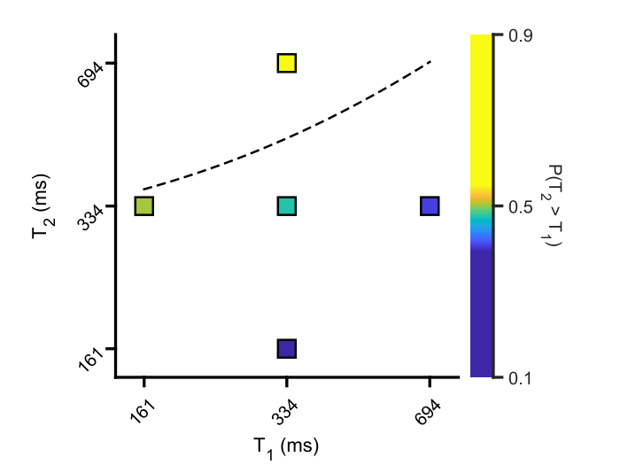

- Same as above, plus a gradient representing the hypothesized continuous performance so as to allow for a better visualization of _contraction bias_ on _T1_;
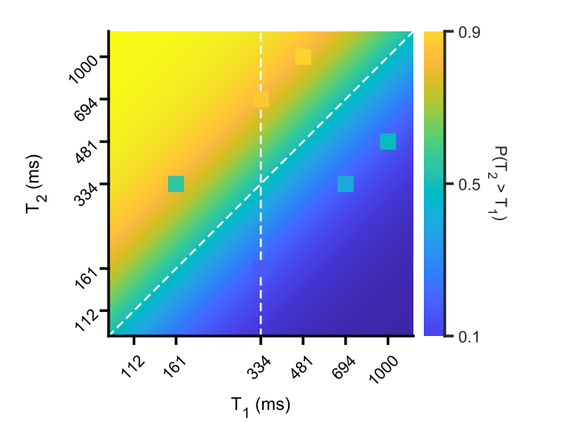

- Plots psychometric curves assuming _T2_ as the stimulus & split by _I1_;
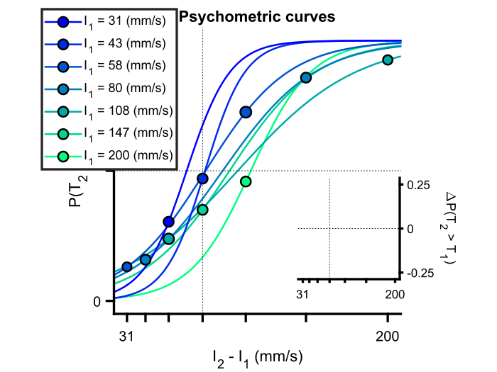

- Same as above, but split by _I2_;
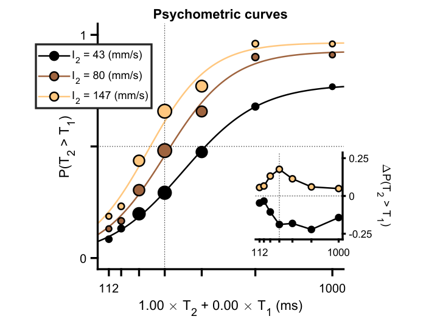

- Fits a generalized linear model (GLM) to _choice_ data using _T1_, _T2_, _I1_ & _I2_ as predictors;
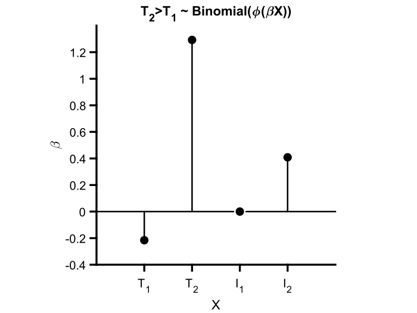

### toso2021_trialTypeDistributions.m
- Plots the joint distribution of trial counts and _T2_ durations (conditioned on _I2_) that neurons were recorded for;
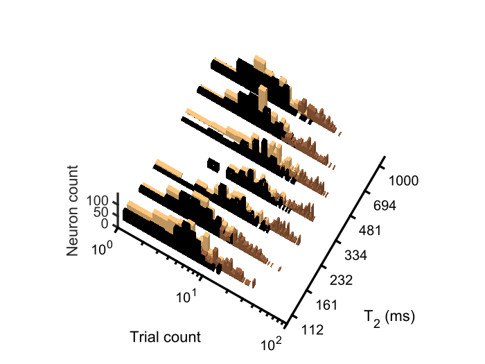

### toso2021_neuronSelection.m
- Selects neurons according to the criteria specified in `toso2021_preface.m` & prints how many passed selection (**affects all subsequent scripts!**);

### toso2021_overallModulation.m
- Plots normalized firing rate averaged across the population of recorded DLS neurons, aligned to different moments in the task and split by the specified contrast (_I1_ below);
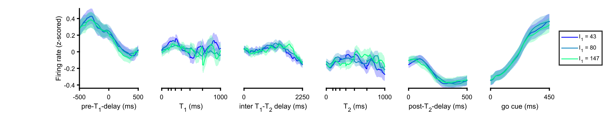

- Same as above, but using _I2_ as contrast;
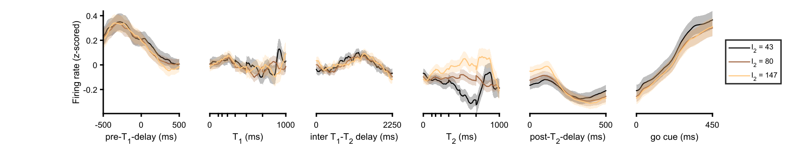

- Same as above, but using _T1_ as contrast;

- Same as above, but using _T2_ as contrast;

- Same as above, but using _choice_ as contrast;
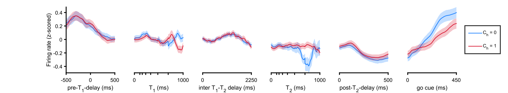

### toso2021_rasters.m
- Plots spike rasters & corresponding spike density functions for the selected neurons (3 examples below);
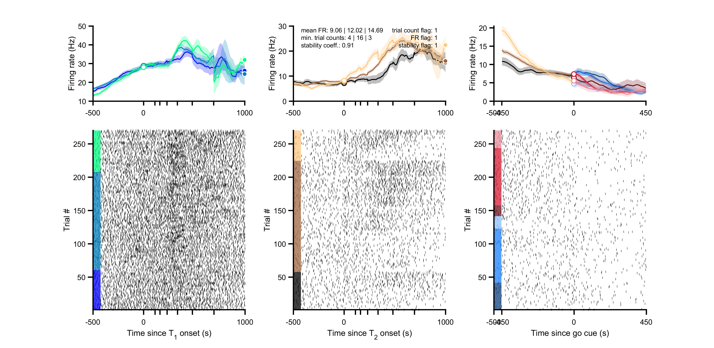
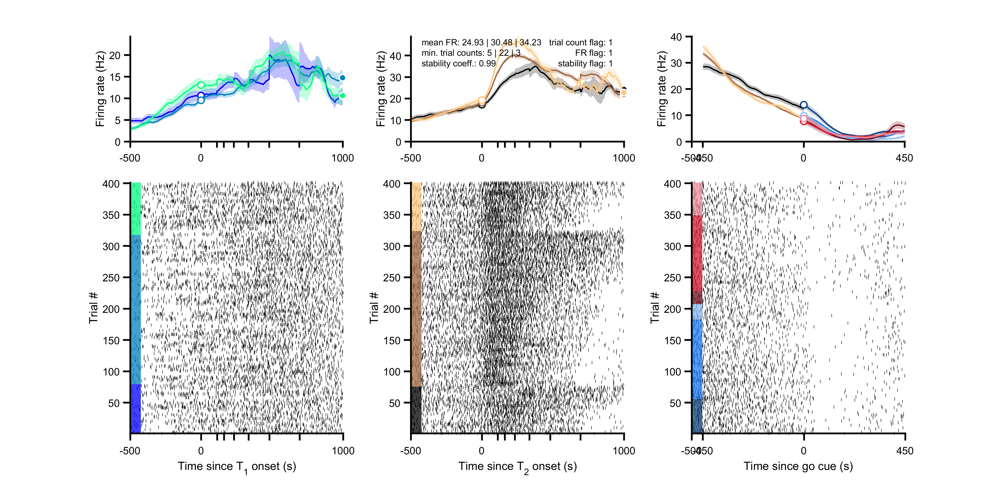
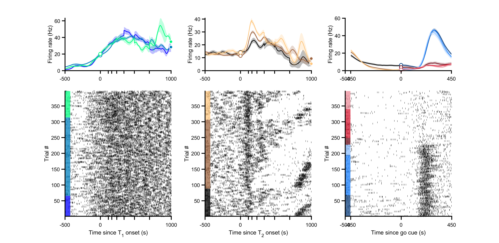

### toso2021_PCA.m
- Plots activity aligned to the onset of _T2_ and conditioned on _I2_ projected onto the subspace defined by its first 3 principal components (PCs);
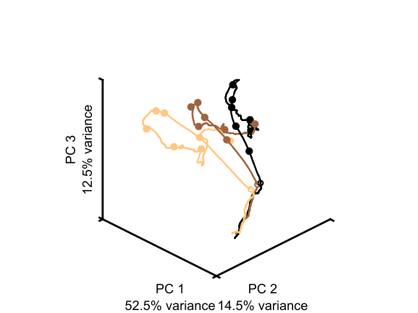

- Plots the same data from above but projected onto individual PCs;
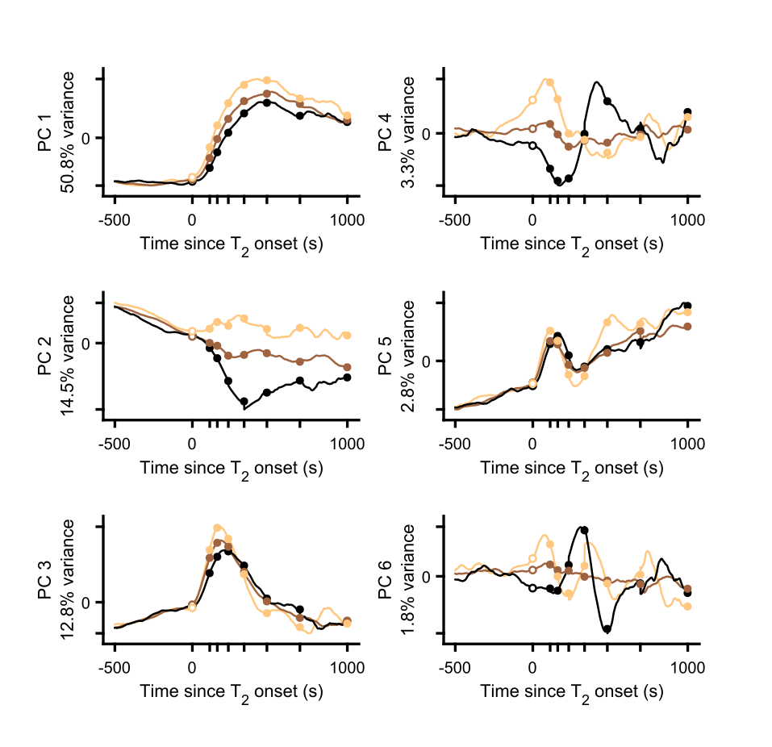

### toso2021_neurometricCurves.m
- Plots neurometric curves (built using linear discriminant analysis (LDA) trained on spike counts recorded in the last 100 ms before _T2_ offset of middle intensity trials) split by the specified intensity contrast (_I1_ below);
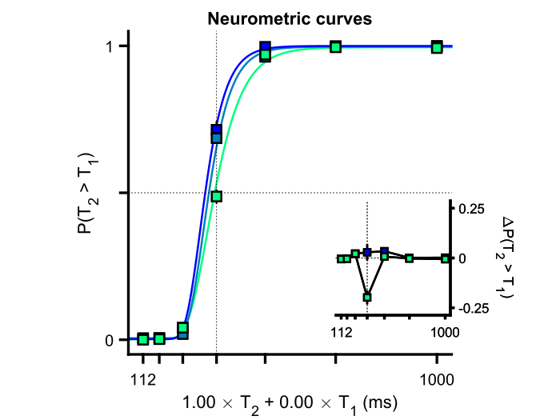

- Same as above, but split by _I2_;
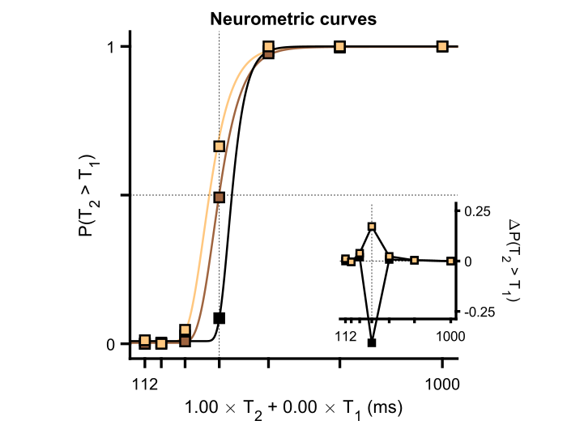
