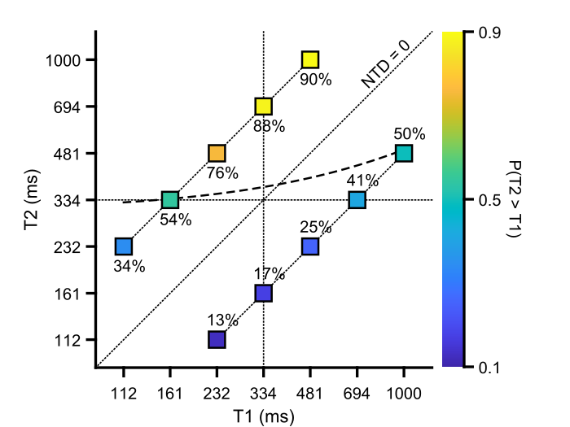
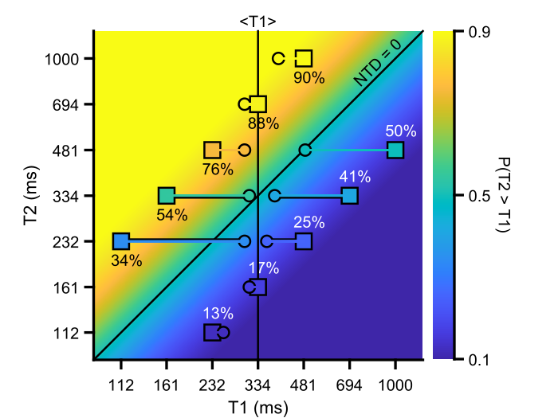
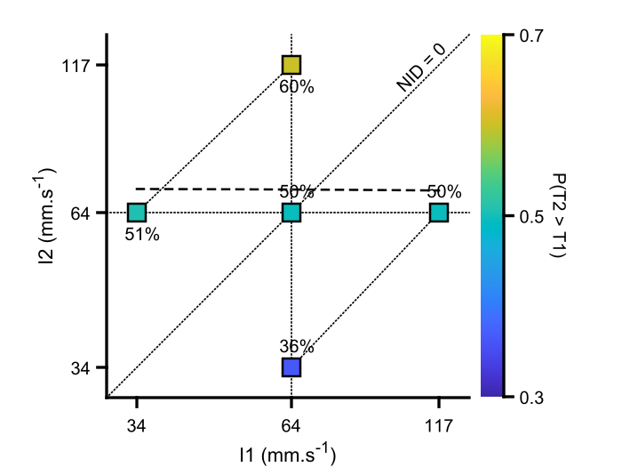
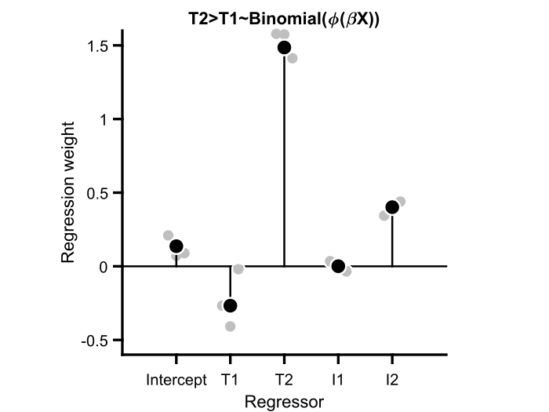
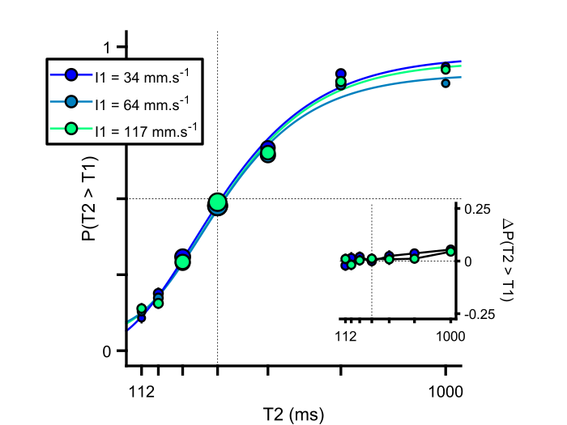
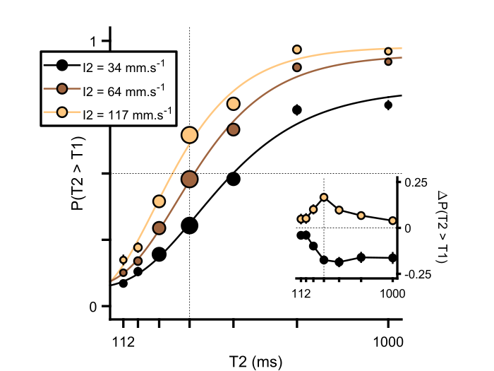
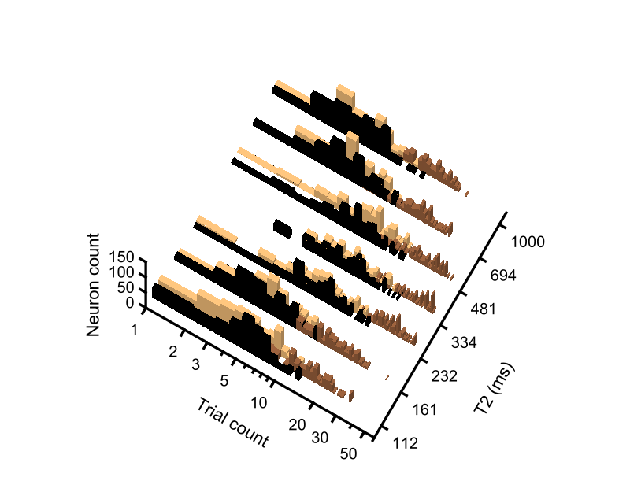
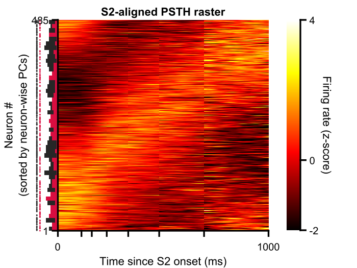
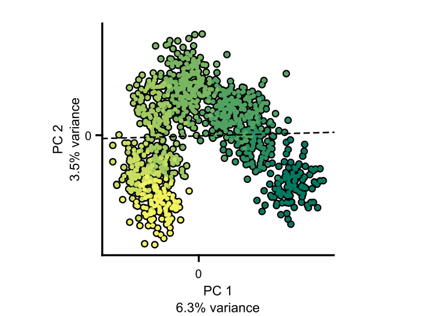
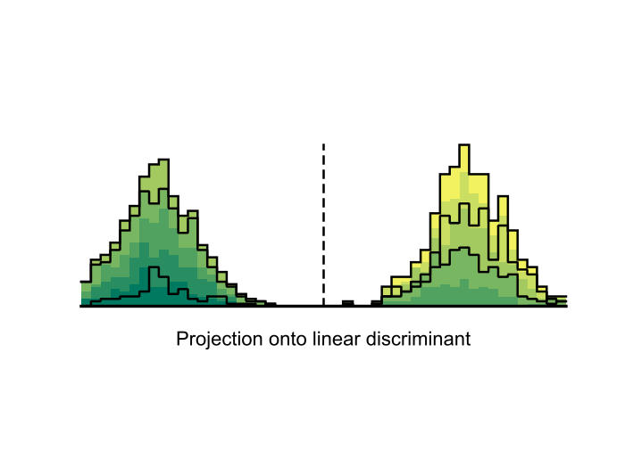

# toso2021-comment

Matlab code (tested on versions 2019b and 2020b) for reanalyzing the behavioral & neural [data](https://data.mendeley.com/datasets/wp9h39kbtv/2) from [Toso et al. 2021](https://doi.org/10.1016/j.neuron.2021.08.020).

### toso2021_wrapper.m  
- Loads the data;
- Selects which task variant to analyze (delayed duration or intensity comparison);
- Sets _if_ and _where_ to save figures;
- Sets which experimental variable to use as contrast;
- Runs all other scripts in sequence (in the same order as they appear below);

### toso2021_preface.m
- Curates the data & prints _before_ & _after_ metrics;
- Parses the data;
- Sets neuron selection criteria;
- Sets aesthetic preferences for figures & axes;
- Sets all color schemes;

### toso2021_generalizationMatrix_Si
- Plots stimulus pairs with the corresponding average performance;

- Same as above, plus a gradient representing the hypothesized continuous performance so as to allow for a better visualization of _contraction bias_ on _T1_;

### toso2021_generalizationMatrix_Di
- Plots distractor pairs with the corresponding average performance;

### toso2021_choiceGLM.m
- Fits a generalized linear model (GLM) to _choice_ data using _T1_, _T2_, _I1_ & _I2_ as predictors, and plots its coefficients;

### toso2021_psychometricCurves.m
- Plots psychometric curves assuming _T2_ as the stimulus & split by _I1_;

- Same as above, but split by _I2_;

### toso2021_trialTypeDistributions.m
- Plots the joint distribution of trial counts and _T2_ durations (conditioned on _I2_) that neurons were recorded for;

### toso2021_neuronSelection.m
- Selects neurons according to the criteria specified in `toso2021_preface.m` & prints how many passed selection (**affects all subsequent scripts!**);

### toso2021_overallModulation.m
- Plots normalized firing rate averaged across the population of recorded DLS neurons, aligned to different moments in the task and split by the specified contrast;

### toso2021_rasters.m
- Plots spike rasters & corresponding spike density functions for the selected neurons (3 examples below);

### toso2021_tiling.m
- Plots a heatmap with average activity from all selected DLS neurons aligned on and during _T2_, and sorted by angular position in principal component (PC) space;

### toso2021_t2AlignedPCA.m
- Plots activity aligned to the onset of _T2_ and conditioned on _I2_ projected onto the subspace defined by its first 3 PCs;

- Plots the same data from above but projected onto individual PCs;

### toso2021_neurometricCurves.m
- Plots population state recorded in the last 100 ms of _T2_ projected onto its first 2 PCs;

- Same data as above, but projected onto the linear discriminant that best separated population state vectors according to whether they came from trials where _T2_ < 334 ms (the median of the _T1_ marginal distribution) or those where _T2_ >= 334 ms;

- Plots neurometric curves split by the specified intensity contrast (_I1_ below);

- Same as above, but split by _I2_;

### toso2021_naiveBayesDecoder.m
- Plots decoder point estimates conditioned on _I2_ and averaged across the 3 central _T2_ stimuli;

